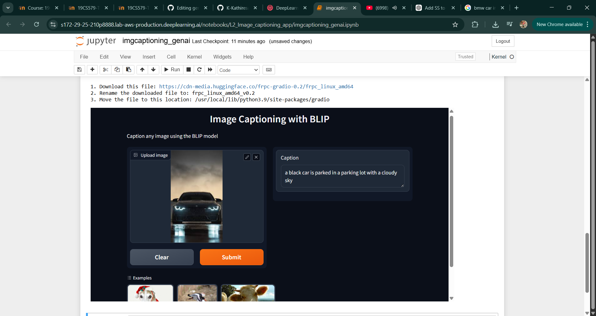

# Prototype Development for Image Captioning Using the BLIP Model and Gradio Framework

## AIM:
To design and deploy a prototype application for image captioning by utilizing the BLIP image-captioning model and integrating it with the Gradio UI framework for user interaction and evaluation.

## PROBLEM STATEMENT:
The goal of this project is to develop a user-friendly application that can generate accurate and descriptive captions for images. Leveraging the BLIP (Bootstrapping Language-Image Pretraining) model, this system aims to bridge the gap between visual and textual data, providing a seamless user experience for image captioning. By integrating with Gradio, the application will allow easy input of images and display the generated captions instantly.

## DESIGN STEPS:
## STEP 1: Model Selection
Select the BLIP image captioning model, which uses a pre-trained architecture for generating textual descriptions from visual inputs.

## STEP 2: Data Preprocessing

Use BLIP's pre-processing pipeline to ensure the input images are properly formatted and ready for caption generation. This includes resizing, normalization, and any other necessary transformations.

## STEP 3: Caption Generation

Implement a function to generate captions from input images using the BLIP model. The function will preprocess the image, pass it through the model, and decode the output to produce human-readable captions.

## STEP 4: Gradio Interface Design

Set up the Gradio UI framework to create a simple, interactive interface where users can upload images. The model's generated captions will be displayed in real-time upon image upload.

## STEP 5: Model Deployment

Deploy the Gradio interface in a local or web-based environment to allow users to interact with the model seamlessly.

## PROGRAM:
```py
import os
import io
import IPython.display
from PIL import Image
import base64 
from dotenv import load_dotenv, find_dotenv
_ = load_dotenv(find_dotenv()) # read local .env file
hf_api_key = os.environ['HF_API_KEY']
# Helper functions
import requests, json

#Image-to-text endpoint
def get_completion(inputs, parameters=None, ENDPOINT_URL=os.environ['HF_API_ITT_BASE']):
    headers = {
      "Authorization": f"Bearer {hf_api_key}",
      "Content-Type": "application/json"
    }
    data = { "inputs": inputs }
    if parameters is not None:
        data.update({"parameters": parameters})
    response = requests.request("POST",
                                ENDPOINT_URL,
                                headers=headers,
                                data=json.dumps(data))
    return json.loads(response.content.decode("utf-8"))
image_url = "https://free-images.com/sm/9596/dog_animal_greyhound_983023.jpg"
display(IPython.display.Image(url=image_url))
get_completion(image_url)
import gradio as gr 

def image_to_base64_str(pil_image):
    byte_arr = io.BytesIO()
    pil_image.save(byte_arr, format='PNG')
    byte_arr = byte_arr.getvalue()
    return str(base64.b64encode(byte_arr).decode('utf-8'))

def captioner(image):
    base64_image = image_to_base64_str(image)
    result = get_completion(base64_image)
    return result[0]['generated_text']

gr.close_all()
demo = gr.Interface(fn=captioner,
                    inputs=[gr.Image(label="Upload image", type="pil")],
                    outputs=[gr.Textbox(label="Caption")],
                    title="Image Captioning with BLIP",
                    description="Caption any image using the BLIP model",
                    allow_flagging="never",
                    examples=["christmas_dog.jpeg", "bird_flight.jpeg", "cow.jpeg"])

demo.launch(share=True, server_port=int(os.environ['PORT1']))

```
## OUTPUT:



## RESULT:
A fully functional image captioning prototype that leverages the BLIP model and Gradio framework, enabling users to interactively upload images and view captions generated by the model.
This prototype demonstrates the ability to bridge visual data with natural language, offering a practical application in areas such as accessibility, content generation, and AI-driven image understanding.

